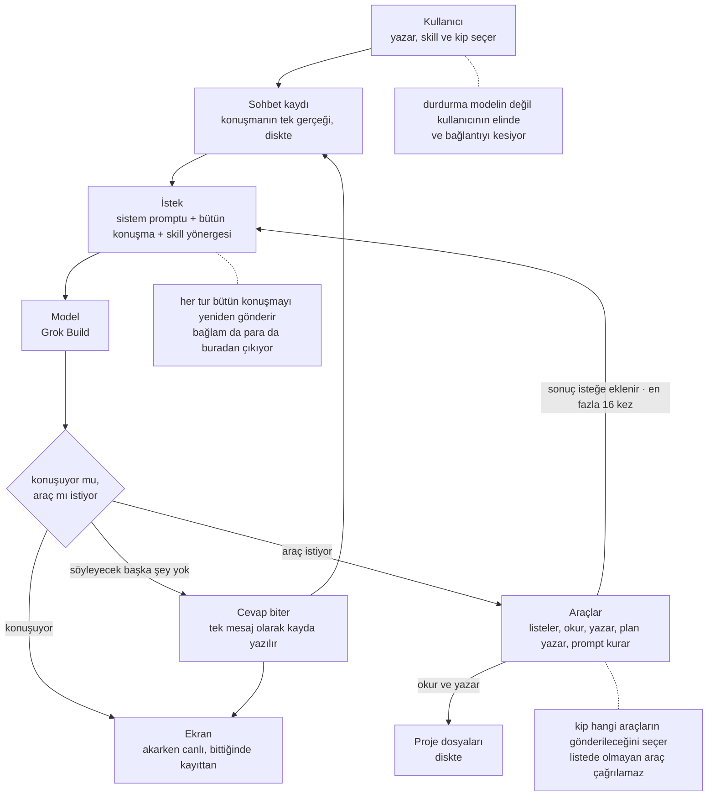
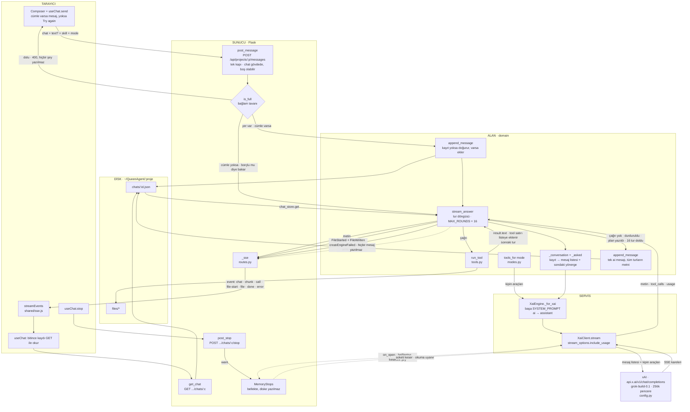
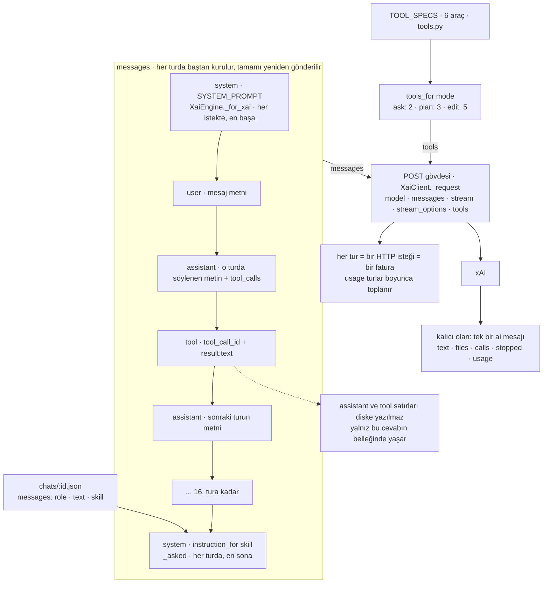
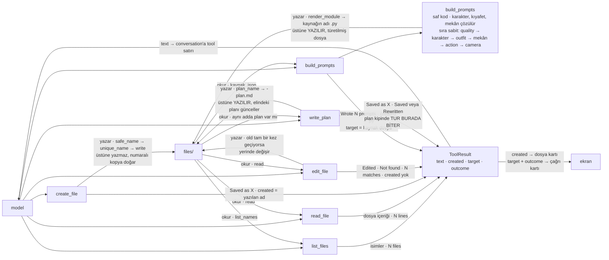

# QueenAgent — AI yolu haritası

*İlk yazımı 26 Ağustos. 27 Ağustos'ta 90, 91, 92, 93, 73 ve 94 koştuktan sonra baştan doğrulandı:
aşağıdaki her ok ve her metin bugünkü koddan okundu.*

## 0 · Genel bakış



Bütün makinenin tek bakışta hâli: soru kayda düşer, kayıt her turda baştan bir isteğe dönüşür, model
ya konuşur ya araç ister, ve iş bitince geriye kalan tek şey kayda yazılan bir mesajdır. Aşağıdaki
üç grafik bu kutuların içini açıyor.

## 1 · Bir cevabın turu



Bir cevabın baştan sona yolu: kullanıcının cümlesi **aynı istekte** diske düşüyor ve cevap **aynı
bağlantıdan** geri geliyor — tarayıcı ikinci bir kapı çalmıyor, ve hiçbir tur kendiliğinden
başlamıyor. `stream_answer` en fazla on altı tur boyunca xAI ile araçlar arasında gidip geliyor. Tur
bitince ekrandaki kayıt akıştan değil diskten okunuyor: kaydın tek evi var.

**Durdurma bir bayrak değil, bir kesme.** İstemci soketi eline geçirdiği anda `on_open` ile onu
kesmenin yolunu `MemoryStops`'a bırakıyor; durdurma isteği geldiğinde bağlantı gerçekten kesiliyor
ve bekleyen okuma uyanıyor. Kopan bağlantı ile gerçek bir ağ hatası aynı istisnayla geliyor, o yüzden
`stream_answer` inanmadan önce kayda soruyor: *bu kesmeyi biz mi istedik.*

## 2 · xAI'ye giden istek



Bir turda xAI'ye giden isteğin içi: sistem promptu **en başta**, o ana kadarki bütün konuşma
ortada, skill yönergesi **en sonda**. İki ölçü aynı yeri gösteriyor — dikkat bir bağlamın iki ucunda
en yüksek ve ortasında üçte birden fazla düşüyor; önbellek ise sabit olanın başta kalmasını
istiyor ki önek tutsun, değişenin sonda durmasını istiyor ki yalnız kendisi bayatlasın.

Yönerge her turda yeniden ekleniyor, bir kez değil: konuşma her turda büyüyor, ve içine bir kez
konan blok ikinci turdan itibaren onların arkasında kalırdı.

**Taşınamayan tek şey araç listesi:** `tools` isteğin ayrı bir alanı ve her zaman en başta işleniyor.
Kipin metni yok, kısıtı var — ve iş zaten kısıtın kendisinde.

**Bağlam tavanı:** bir sohbet 50.000 jetona ulaştıktan sonra yeni tur almıyor
(`CONTEXT_CEILING`, `chat.py`). Pencere 256k, yani tavan onun beşte biri; ölçülen şey son cevabın
gönderdiği jeton sayısı, ve kapı hiçbir şey yazmadan önce reddediyor. Kayıtla birlikte tarayıcıya
`context: {sent, ceiling}` gidiyor — bestecinin altındaki halka onu çiziyor, ve payda kodda tek
yerde duruyor.

## 3 · Araçlar



Modelin projeye dokunabildiği altı yol ve her birinin geriye ne söylediği. Dosyanın içeriğini modelin
kendisi yazıyor; tek istisna `build_prompts`, orada promptları kuran saf bir fonksiyon var.

Üstüne yazan iki araç var ve ikisinin de sebebi ayrı: `build_prompts`'un çıktısı türetilmiş bir
dosya, `write_plan`'inki ise güncellenmesi beklenen tek bir plan.

### Kipler — `modes.py`

| Kip | Eline verilen araçlar |
|---|---|
| `ask` | `list_files`, `read_file` |
| `plan` | `list_files`, `read_file`, `write_plan` |
| `edit` *(varsayılan)* | `list_files`, `read_file`, `create_file`, `edit_file`, `build_prompts` |

Kural bir cümle değil, listenin kendisi: istekte olmayan bir araç çağrılamaz. Plan kipine
`create_file` verilmiyor, çünkü verilseydi planı ve işin kendisini aynı turda yazabilirdi — ki bu
planlamak değil, yapmak olurdu. Tanınmayan bir kip varsayılana düşüyor, boş listeye değil: araçsız
bir model, araç kullanmamaya karar vermiş bir modelden ayırt edilemez.

## 4 · Promptlar

### SYSTEM_PROMPT — `backend/features/workspace/domain/prompt.py`

Her isteğin en başında, skill seçilsin seçilmesin. Madde 73'ten beri nasıl çalışılacağını da
söylüyor — ve yalnız onu: hiçbir görev adı taşımıyor, ve bir test bunu yedi kelimeyle sınıyor.

```text
You are QueenAgent, a small AI workspace. Answer the user directly and concisely, in the language the user writes in.

You are inside one project. The project holds files, and every chat in it can see them. Use list_files to see what exists, and when the answer depends on a file, read it first with read_file. Having seen it earlier in this chat is not the same thing: what the next step reads is what is on disk now.

Only call create_file when the user asked for something worth keeping as a document -- a draft, a report, a summary they will come back to. An ordinary reply is not a file.

A correction the user makes afterwards reaches the file too. One that lands only in the chat leaves the file saying the older thing, and the file is what gets read next.

Ask rather than invent. Anything the user has not settled -- a count, a name, a choice between two readings -- is worth one question, because a guess is either more than they wanted or less, and nothing on the screen says which of the two happened.

Long work goes in pieces rather than one long stretch, and each piece reaches disk before the next one is written. Quality falls away towards the end of a long answer, and an interruption then costs one piece instead of everything.

Always write your answer in the chat as well. A file never stands in for the reply. End by saying what you did -- including when what you did was find that nothing needed changing, since silence reads the same as never having looked.
```

### GENERATE_PROMPTS_PLUS — `skills.py` · `generate-prompts-plus`

Madde 94'ten beri **tek skill**. Yanında duran beşi — senaryo, karakter promptu, karelere bölme,
düz prompt yazma, denetim — silindi; nasıl çalışılacağını söyleyen kısımları yukarıdaki tabana
geçmişti, işin kendi bilgisi ya bu metinde duruyor ya da bilerek gitti.

```text
When the user asks for the prompts of a frame list, this skill builds them from parts, so a character reads the same in every frame for a stronger reason than remembering to copy it.

The structure is one JSON file per scenario, named after it, as in intro-frames.json:

{
  "quality": "score_9_up, masterpiece, best quality, absurdres",
  "characters": { "aylin": "1girl, long teal hair, ..." },
  "outfits": { "gunluk": "jeans, black t-shirt", "atki": "red knit scarf" },
  "locations": { "bedroom": "sunlit bedroom, morning light, ..." },
  "frames": [
    { "characters": { "aylin": ["gunluk", "atki"] }, "location": "bedroom",
      "action": "sitting on the edge of the bed, holding a letter",
      "camera": "medium shot, from slightly above" }
  ]
}

Whatever repeats across frames is written once, in the maps at the top. A frame names it and never carries the text again -- that is what makes updating a character one edit instead of forty. location is a single name because a frame happens in one place.

What a character always is goes in characters; what changes from frame to frame goes in outfits. Clothing is the thing that changes, so it never belongs in a character's own entry. An outfit is named after the garment rather than whoever wears it, because two characters can wear the same one.

A frame's characters is a map: the key is the character, the value is the outfits they wear in that frame. Someone wearing nothing named has an empty list, and a frame with nobody in it is an empty map.

Take the character and place tags from what the user settled in the chat. If a frame needs one that was never settled, ask for it rather than inventing it.

Everything in this file is English -- an image model reads it.

Write it in two stages. First the skeleton -- the quality tags, the maps, and an empty frames list -- with create_file. Then add the frames with edit_file in batches of five, each batch reaching disk before the next one is written. Never the whole list in one answer.

Before building, hold the file against these rules and fix what you find:

1. A frame describing a character or a place in plain words when the maps already hold an entry for it. This is the one worth hunting: it is the silent copy coming back.
2. Clothing written inside a character's own entry, or inside a frame's action, when outfits is where it belongs. Both are rule 1 wearing different clothes: the text copied in instead of the name named.
3. Quality tags written inside a frame's own fields. Code adds them once, so they would be printed twice.
4. The same name carrying different text in two structure files in this project. Copying is allowed; a copy that has drifted is not.
5. A name defined in a map and used by no frame -- a note, not a violation.

Then call build_prompts with the structure file's name. It resolves the names and assembles every frame in a fixed order. Do not assemble a prompt yourself and do not write the Python file by hand: doing either takes away the only thing this skill has that the plain one has not.
```

### RULEBOOK — `skills.py`

Yukarıdaki metnin içine gömülen beş kural. Denetim skill'i gidene kadar iki okuyucusu vardı; şimdi
tek, ve her kurmadan önce uygulanıyor. Ayrı bir sabit olarak duruyor çünkü kurallar sayılabilir ve
alıntılanabilir olmalı.

### TOOL_SPECS — `backend/features/workspace/domain/tools.py`

Modele giden tarifler. Hangilerinin gönderileceğine kip karar veriyor.

```text
list_files
  List the names of the files this project already holds.
  parametre yok

read_file
  Read one of this project's files.
  name: The file's name.

create_file
  Save a document into this project. Reach for it only when the user asked for something worth keeping as a file.
  name: A short file name ending in .md.
  content: The document itself.

edit_file
  Change part of a file that already exists. The text you give as old must appear exactly once, so include enough of what surrounds it to be sure.
  name: The file's name.
  old: The exact text to replace.
  new: What takes its place. Empty takes the text out.

build_prompts
  Build the prompt list from a structure file. Code assembles every frame in a fixed order, so a character reads the same in all of them. Writes a Python file named after the structure, replacing what it wrote last time.
  name: The structure file's name.

write_plan
  Break the work into numbered steps and save the plan. Writes over the plan of that name if there is one, so read it first and hand back the whole plan rather than the part you changed. The turn ends here: the user reads the plan, fixes it in the file if they want to, and runs it themselves.
  name: What the plan is for, as in bar-scene.
  content: The plan itself.
```

Plan kipinin bütün yönergesi bu tarifin içinde duruyor. Ayrı bir kip metni yazılmadı: yetkiyi araç
listesi veriyor, ve o listede tek yazan aracın kendi tarifi zaten ne beklendiğini söylüyor.
