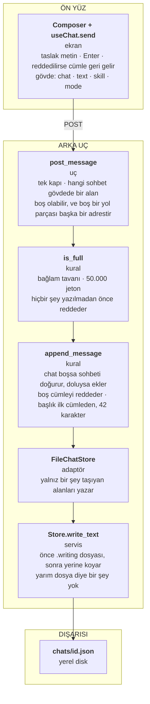
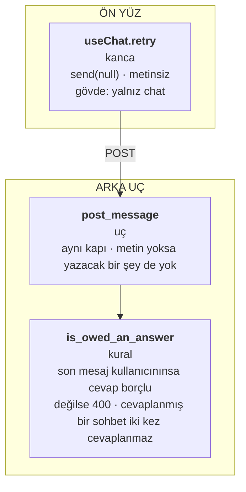
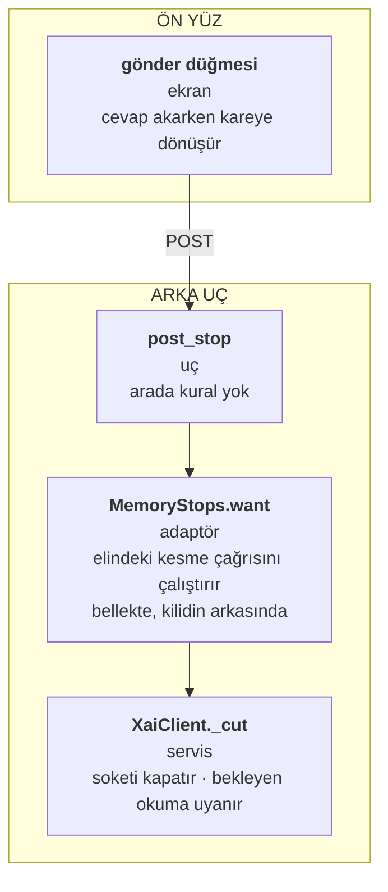
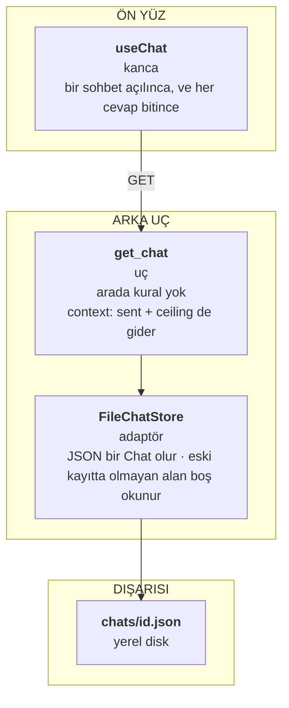
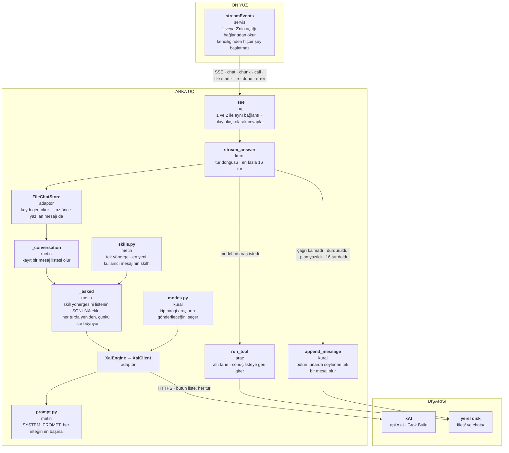
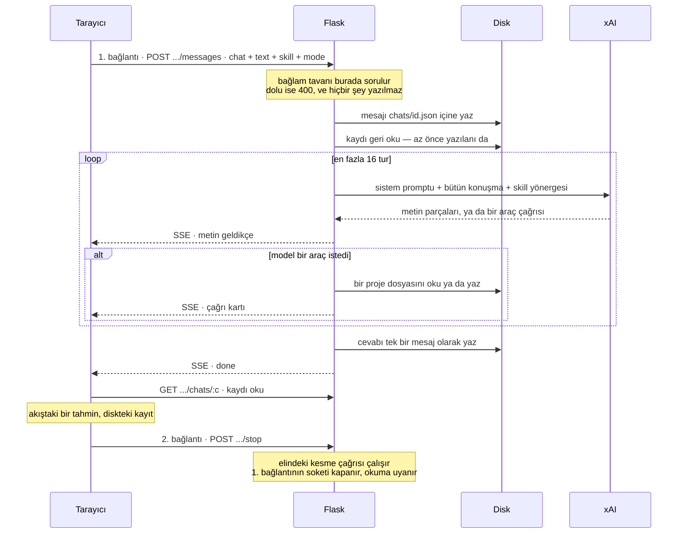

# QueenAgent — bir istek nasıl atılıyor

> ⚠️ **Ayrıntıları 27 Ağustos'ta kaldı** *(not: 4 Eylül)*. **Tesisatın şekli hâlâ doğru** — uçlar,
> olaylar, tek bağlantı, kaydın tek evi: hepsi bugün de böyle. Eskiyen şey diyagramların içindeki
> sayılar ve adlar: 5'teki *"altı tane"* araç **17**, ve v6–v7 koşuları o gün olmayan bir şey daha
> ekledi — `write_frame_prompt` kare başına **kendi isteğini** atıyor, yani xAI'ye giden tek istek
> türü artık ana ajanınki değil.
>
> **Modele giden metinlerin listesi ve isteğin katmanları için:**
> [modele giden her metin](2026-08-28-queenagent-promptlar.md).

*İlk yazımı 26 Ağustos. 27 Ağustos'ta 87, 88, 90, 91, 92 ve 93 koştuktan sonra baştan doğrulandı.
En büyük değişiklik yapısal: eskiden ilk mesaj ile takip mesajı ayrı iki vakaydı, artık tek — Madde
87 iki kapıyı bire indirdi, ve bu belgenin o günkü "aynı şekil, aynı depo" notu tam olarak bunun
gerekçesiydi.*

Her kutu ilk satırda kendi adını, ikinci satırda ne tür bir şey olduğunu, altında da ne yaptığını
taşıyor.

## 1 · Bir cümle göndermek

Burada model yok: sistem promptu yok, skill yönergesi yok, xAI yok. Bu ayak yalnız bir cümleyi diske
koyuyor. Skill mesajın üstüne yazılıyor ama onu okuyan ilk yer 5.

**İlk mesaj ile takip mesajı arasındaki tek fark gövdedeki `chat` alanının boş olup olmadığı.** Sohbet
ilk mesajıyla doğuyor — boş sohbet diye bir şey yok — ve başlığını o cümleden alıyor.

Aynı istek cevabı da başlatıyor; ikinci bir bağlantı açılmıyor. Devamı 5'te.

## 2 · Tekrar denemek

1 ile aynı kapı, ve fark tek bir soru: gövdede cümle var mı. Cümle varsa önce yazılır, yoksa diskte
bekleyen soru cevaplanır. **Boş cümle ile hiç cümle aynı şey değil** — boş bir cümle klavyeye
yaslanmış biridir ve reddedilir.

Bu ayak diske hiçbir şey yazmıyor; yaptığı tek şey 5'i başlatmak.

## 3 · Durdurmak

Diske hiç uğramayan tek zincir, ve **bir bayrak değil bir kesme**. İstemci soketi eline geçirdiği an
onu kesmenin yolunu `MemoryStops`'a bırakıyor; durdurma o yolu çağırıyor. Bekleyen okumayı uyandıran
şey bu — bir bayrak sorulmayı beklerdi, ve ilk kelimeden önceki bekleyişte sorulacak bir yer yok.

Kesilen bağlantı ile kopan bir ağ aynı istisnayla geliyor, o yüzden `stream_answer` inanmadan önce
kayda soruyor: *bu kesmeyi biz mi istedik.* Cevap bellekte yaşıyor ve durdurduğu cevapla ölüyor —
yazılsaydı kendi cevabından uzun yaşar ve bir sonrakini doğarken keserdi.

Bu istek kendi bağlantısında geliyor, çünkü durdurduğu cevap hâlâ bir başkasından akıyor.

## 4 · Bir sohbeti açmak

En kısa yol: uç doğrudan adaptöre iniyor, arada kural yok, çünkü bir kaydı geri okumanın uygulanacak
kuralı yok.

**Kaydın tek evi burası.** Bir cevap bittiğinde tarayıcı akışta biriktirdiğini atıp kaydı buradan
okuyor — akıştaki bir tahmin, diskteki ise kayıt.

## 5 · Cevabın kendisi

1'de veya 2'de gönderilen isteğin geri kalanı: soru diskten okunuyor, bir mesaj listesine dönüyor ve
xAI'ye bütün hâlinde gidiyor. **Her tur baştan bir istek** ve bütün konuşmayı taşıyor; cevap aynı
bağlantıdan SSE kareleri olarak geri iniyor ve sonunda tek bir mesaj olarak yazılıyor.

Sistem promptu en başta duruyor, skill yönergesi en sonda — dikkat bir bağlamın iki ucunda en
yüksek, ve önbellek sabit olanın başta kalmasını istiyor.

## Sıra

Diski dinleyen hiçbir şey yok: her adımı tarayıcı başlatıyor, ve **bir cümle ile onun cevabı tek
bağlantı**. Sohbet kaydı hem girdi hem çıktı, ve sunucu iki istek arasında hiçbir şey hatırlamıyor.

Ayrıntı — hangi fonksiyon, hangi olay, hangi alan — [AI yolu
haritasında](2026-08-26-queenagent-ai-yolu-haritasi.md).
