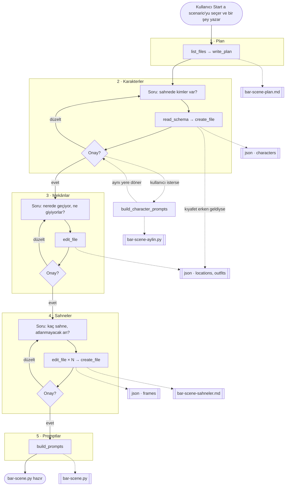
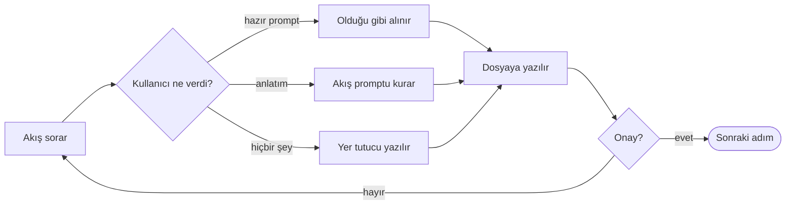

# Akış skill'i — kullanıcının yaşadığı yol

**Tarih:** 27 Ağustos 2026 · **Durum:** kararları verilmiş, koşusu
[v6 yol haritasında](superpowers/plans/2026-08-27-queenagent-v6-roadmap.md).

**Kardeş belgeler:** [karar defteri](2026-08-27-queenagent-skill-kararlari.md) ·
[problemler](2026-08-27-queenagent-skill-problemleri.md)

---

## İki kural

*(kullanıcı kararı, 27 Ağustos)*

**Dallanma yok.** Akış düz bir zincir. Her adımın tek bir çıktısı var ve o çıktı kullanıcının ne
kadar anlattığına göre değişmiyor. İki ayrı yol iki ayrı hâl demek, ve hâller çoğaldıkça akışın
nerede olduğu belirsizleşiyor.

**Her adım kendi içinde döngü.** Kullanıcı onay verene kadar bir sonrakine geçilmiyor. Adım kaç tur
sürerse sürsün — bir turda da biter, beş turda da — çıkışı aynı.

### Zincirin tamamı



### Bir adımın içi

Adımlar aynı iskeleti taşıyor. Kullanıcının cevabı üç türlü gelebiliyor ve üçü de aynı çıkışa
varıyor — dallanma adımın **içinde** kapanıyor, zincire taşmıyor:



---

## Adımlar

| # | Adım | Çıktısı — her zaman aynı |
|---|---|---|
| 1 | **Plan** | `bar-scene-plan.md`. Kullanıcı ne yazmış olursa olsun ilk iş bu. |
| 2 | **Karakterler** | `bar-scene.json` — `characters` dolu. |
| 3 | **Mekânlar** | Aynı dosyada `locations` ve `outfits` dolu. |
| 4 | **Sahneler** | `frames` dolu, **ve** `bar-scene-sahneler.md` — her sahne bir cümle. |
| 5 | **Promptlar** | `bar-scene.py`. |

Plan akışın hafızası: sohbet uzayınca model nerede kaldığını sohbetten değil oradan okuyor, ve
kullanıcı istediği an açıp bakabiliyor.

---

## 1 · Plan

Kullanıcı **Start a scenario** skill'ini seçer ve ne yazarsa yazsın — *"başlayalım"* da olur, sahnenin
tarifi de — akış aynı şeyi yapar: projeye bakar, planı yazar, ilk soruyu sorar.

```
⏺ list_files                          No files
⏺ write_plan(bar-scene)               Saved
```

> Yolu `bar-scene-plan.md`'ye yazdım. **Karakterler:** sahnede kimler var?

Anlatılan varsa plan onunla doluyor, yoksa iskeletiyle. Kullanıcının ne kadar anlattığı adımın
çıktısını değiştirmiyor.

**Yarım kalan işe yeni bir sohbetten devam edilir.** Dosyalar projenin, sohbetin değil: akış ilk iş
olarak projeye baktığı için orada duran bir planı görüyor, okuyor, ve açık kalan adımdan devam
ediyor — yeni plan yazmıyor. Sohbet saçmaladığında ya da bağlam tavana çarptığında *(Madde 92)*
yapılacak şey bu: yeni sohbet açmak, ve akış kaldığı yerden sürüyor. Projede birden fazla plan varsa
hangisini sürdüreceğini soruyor.

## 2 · Karakterler

Kullanıcı iki türlü cevap verebilir, ve akış ikisini de aynı yere götürür:

- **Hazır prompt verir** — `short black hair, stubble, brown eyes` — akış olduğu gibi alır.
- **Anlatır** — *"25 yaşında, uzun siyah saçlı, yeşil gözlü"* — akış promptu kendisi kurar.

Karakter birden fazla olabilir; hepsi aynı adımda toplanır. **Hiç yoksa** akış yer tutucu bir
karakter yazar ve devam eder — `1girl, long hair, plain clothes` gibi basit bir tarif. Sahnenin
ilerlemesi karakter tarifine takılmıyor.

Kullanıcı karakteri anlatırken **kıyafetini de söyleyebilir** — *"Aylin gecelikte"*. Akış onu
duyduğu yerde `outfits`'e yazar; bir sonraki adımda aynı şeyi bir daha sormaz. Adımın çıkışı yine
aynı: bilginin nereden geldiği değişiyor, adımın ne bıraktığı değişmiyor.

```
⏺ read_schema                         Structure
⏺ create_file(bar-scene.json)         Saved
```

> Aylin ve Deniz kaydedildi. Onaylıyor musun, yoksa düzeltmek istediğin var mı?

Onay gelene kadar bu adımda kalınıyor.

## 3 · Mekânlar

Karakterle birebir aynı: kullanıcı ya hazır prompt verir ya anlatır, akış ikisinde de doğru
davranır. Bir önceki adımda söylenmemiş kıyafetler de burada toplanıyor. Mekân da anlatılmazsa yer
tutucu yazılıyor — `plain background` gibi.

```
⏺ edit_file(bar-scene.json)           Edited
```

> Bar ve gecelik/ceket kaydedildi. Onaylıyor musun?

## 4 · Sahneler

Akış kaç sahne olacağını ve atlanmaması gereken anları sorar, sonra **iki şeyi birden** yazar:
`frames` dizisi yapı dosyasına, ve okunacak liste kendi dosyasına — her sahne **bir cümle**.

```
⏺ edit_file(bar-scene.json)           Edited
⏺ edit_file(bar-scene.json)           Edited
⏺ create_file(bar-scene-sahneler.md)  Saved
```

`bar-scene-sahneler.md`:

```markdown
1. Aylin barda tek başına, elinde bardak.
2. Kapı açılıyor, Deniz eşikte.
...
8. İkisi yan yana konuşuyor.
```

> Sekiz sahne hazır, listesi `bar-scene-sahneler.md`'de. Onaylıyor musun?

**Bilinen ve kabul edilen bedel** *(kullanıcı kararı, 27 Ağustos)*: aynı sahne iki yerde duruyor —
`frames` içinde etiket olarak, md'de cümle olarak. Biri elle düzeltilip öteki unutulursa ikisi
ayrışıyor. Kod bunu kovalamıyor; dosyaları kullanan kişi kendi işine bakıyor.

## 5 · Promptlar

Onay gelince akış promptları kurar:

```
⏺ build_prompts(bar-scene.json)       8 prompts
```

> `bar-scene.py` hazır. Bir sahneyi değiştirmek istersen söyle, düzeltip yeniden kurarım.

---

## Karakteri denemek — `build_character_prompts`

Kullanıcı bir karakteri sahneye girmeden görmek isteyebiliyor: *"Aylin nasıl çıkıyor, bakayım."*
Bunun için ikinci bir kurucu araç var — `build_prompts`'ın kardeşi, ve onunla aynı sırayı, aynı
etiket birleştirmesini kullanıyor. Karakter denemede nasıl görünüyorsa sahnede de öyle görünüyor.

Yaptığı iş **karakter × kıyafetler**: yapı dosyasındaki her kıyafet için bir prompt, düz bir liste.
İçinde model yok, tıpkı `build_prompts` gibi — kod etiketleri birleştiriyor, o kadar.

```
⏺ build_character_prompts(bar-scene.json, aylin)   3 prompts
```

`bar-scene-aylin.py`:

```python
PROMPTS = [
    """score_9, ..., long black hair, green eyes, mature female, white nightgown""",
    """score_9, ..., long black hair, green eyes, mature female, red dress""",
    """score_9, ..., long black hair, green eyes, mature female, black coat""",
]
```

Kıyafeti olmayan bir karakter tek satır veriyor. Çıktı kendi dosyasına yazılıyor, yani sahnenin
prompt listesine karışmıyor.

Akış bunu karakter adımında teklif ediyor, ama bir adım değil — yan kapı. Kullanıcı istemezse akış
olduğu yerden devam ediyor.

## prompt+ ne oluyor

Yerinde duruyor, ve işi **var olanı güncellemek**: elinde yapı dosyası olan kullanıcı akışa
girmeden doğrudan onu çağırıyor — bir karakteri değiştirmek, kare eklemek, listeyi yeniden kurmak
için. Akış sıfırdan kuran yol, prompt+ elde olanı süren yol.

---

## Şema araçtan okunuyor

`read_schema` çağrılınca geliyor, iki skill metnine de gömülmüyor. Yönerge her turda yeniden
gönderiliyor *(Madde 93)*; şema ise yalnız yazma anında lazım.

---

## Skill'in adı

**Start a scenario.** Çıkan şey tek bir sahne değil — karakterler, mekânlar, N sahne ve prompt
listesi, yani bir senaryo. Yapı dosyasının bugünkü tanımı da bu: senaryo başına bir JSON. Ad
İngilizce, çünkü QueenAgent'ın arayüzü İngilizce, ve bugünkü satır *"Generate prompts+"*.
