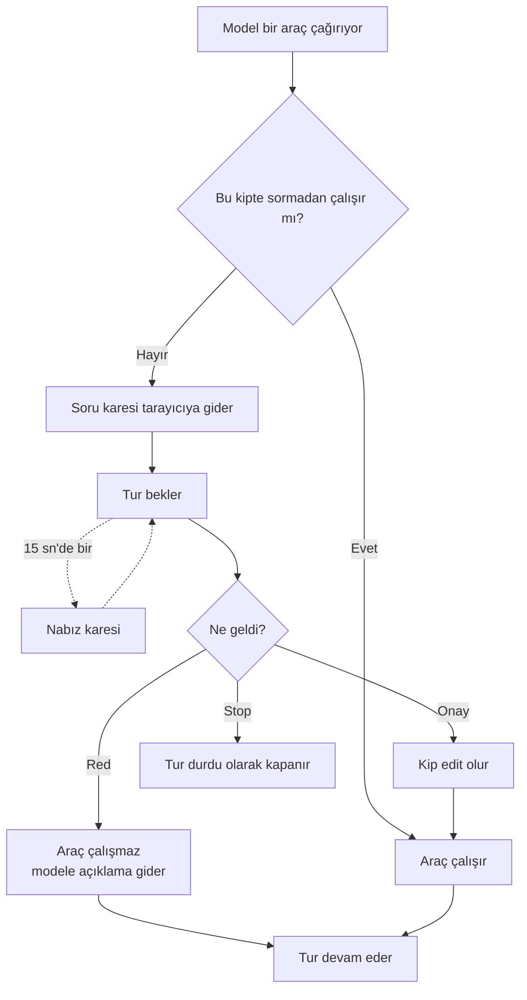

# İzin tur ortasında sorulur — tasarım ve bölünme

**Tarih:** 2026-08-28 · **Branch:** `feat/queenagent-v5` ·
**Kaynak:** [v5 yol haritası](../plans/2026-08-25-queenagent-v5-roadmap.md) — Blok 6, Madde 99 ·
**Ne yapar:** Madde 99'un tasarımını açar ve yol haritasının beklediği bölünmeyi verir —
**99, 102, 103**. Numaralar kaymıyor; yeni olanlar sondan alınıyor.

---

## Neden

Kip bugün modele hangi araçların verildiğini söylüyor, ve verilmeyen araç çağrılamıyor *(Madde
91)*. Kural doğru, ama bir kör noktası var: soru kipinde duran kullanıcı dosya isteyince model
yazamıyor, **ve ekran neden yazamadığını söylemiyor.** Model ya sessizce başka bir şey yapıyor ya
da yazdığını sanıyor.

Kip artık **sormadan çalışabilenlerin** listesi oluyor. Araçların hepsi modele veriliyor; listede
olmayan biri çağrıldığında tur duruyor, ekran soruyor, ve cevap gelene kadar bekliyor.

**Madde 91 yerinde duruyor.** Onun söylediği şey *"yetki bir cümle değildir"*di — yönergeye *"dosya
yazma"* yazmak bir ricadır, ve verify skill'i o ricanın ne ettiğinin kanıtıydı. Bu tasarım o cümleyi
geri getirmiyor: yetki hâlâ kodda, yalnız kapı **araç listesinden** değil **çalıştırma anından**
geçiyor. Model izinsiz yazamıyor; değişen tek şey, izinsizliğin artık bir cevabı olması.

## Akış

## Bekleyiş

**Süresiz.** Bir sayı koymuyoruz, ve bu yeni bir politika değil: bugün de hiçbir yerde zaman aşımı
yok — `urlopen` çıplak çağrılıyor, `socket.setdefaulttimeout` hiç çağrılmıyor. Model bir saat
düşünse boru açık bekliyor. İzin beklemesi de aynı politikayı sürdürüyor.

Dışarıdan gelen bir sınır da yok. xAI sunucu tarafında ne azami istek süresi belgeliyor ne boşta
kalma zaman aşımı; belgelerdeki tek sayı istemciye öneri — *akıl yürüten modellerde bağlantıyı
erken kapatmayın* diye 3600 saniye. Önbelleğin ne kadar sürede soğuduğu ise **belgelenmemiş**: xAI
yalnız nasıl düştüğünü söylüyor *(bellek baskısı, isteğin başka sunucuya düşmesi)*. Yani uzun
bekleyişin bilinen bedeli tek: onaydan sonraki tur önekini önbellekte bulamayabilir ve tam ücretle
faturalanır. Para, arıza değil.

**Çıkış kapısı sayı değil, Stop.** Bekleyen tur durdurma bayrağını da dinliyor, yani kullanıcı ne
zaman sıkılırsa bekleyiş o zaman bitiyor — biz onun adına karar vermiyoruz. Bunun bir inceliği var:
izin beklenirken kesilecek bir soket **yok**, çünkü xAI isteği çoktan kapandı — araç çağrısı turun
son karesiyle geliyor ve akış `[DONE]` ile bitiyor. Bu yüzden bekleyiş, `stops`'a kesme yerine bir
**uyandırma** bırakıyor. `hold` zaten *"tuşa bağlantı doğmadan basıldıysa hemen çalıştır"* yarışını
çözüyor, ve burada da aynı yarış var.

**Nabız: 15 saniye.** İki işi birden yapıyor:

- **Boruyu diri tutuyor.** Yerelde susan bir akışı kesen yok, ama defter yolu `cloudflared`'ın
  içinden geçiyor ve tünelde susan akış kesilen şey. Sayı ölçülmedi; SSE'de alışılmış aralık bu, ve
  yaygın vekillerin boşta kalma penceresinin epey altında.
- **Ölmüş turu topluyor.** Sekme kapanınca bunu haber veren bir şey yok — yazmayı deneyene kadar.
  Nabız o deneme, ve başarısız olduğunda üretici kapanıyor.

Nabız **yorum satırı** olarak gidiyor. Ön yüzün ayrıştırıcısı `event:` taşımayan kareyi zaten
düşürüyor *(`sse.js` `parseFrame`)*, yani tarayıcı tarafında yazılacak tek satır yok. xAI'ın bize
yaptığının aynısı — istemcimiz de onların nabız satırlarını atlıyor.

## Kararın geri gelişi

`stops`'un kalıbı: bellekte bir kayıt, ayrı bir istekle beslenen. Diske yazılmıyor, ve bu *"gerçek
diskte durur"* kuralının istisnası değil — burada tutulan şey tam olarak bir tur kadar yaşıyor.
Süreç ölürse bekleyen tur da ölüyor, geriye cevaplanacak bir soru kalmıyor.

Yeni bir port: **`Permissions`**. Soruyu açıyor, cevabı alıyor, bekleyeni uyandırıyor. Bekleme
`threading.Event` üstünde — nabız aralığı `wait`'in zaman aşımı oluyor, yani cevap geldiği anda
uyanıyor, gelmediğinde tam zamanında nabız atıyor. Yoklama yok.

Kapı `stop`'un kardeşi: `POST /api/projects/<pid>/chats/<cid>/permission`, gövdede `allowed` ve
istenirse `reason`. Sohbet yoksa 404; onun dışında cevabı boş — kararın ne ettiği bu istekte değil,
akan turda görülüyor.

## Onay

Kip **edit** oluyor ve **aynı tur** kaldığı yerden devam ediyor. Kip artık isteğin taşıdığı araç
listesini belirlemediği için bu değişiklik bir sonraki isteği değiştirmiyor; yalnız kapıyı açık
tutuyor — turun geri kalanında aynı soru bir daha sorulmuyor.

Bir yan sonucu var ve isteniyor: plan kipinde bir yazma onaylandığında kip edit olduğu için planın
turu bitirme kuralı *(Madde 97, K22)* o turda artık işlemiyor. Doğrusu bu — kullanıcı *"yaz"*
demiştir, ve turun orada bitmesi tam da o izni boşa çıkarırdı.

Ekranın kip seçicisi de edit'e kayıyor: seçici oturumun değeri üstünde duruyor, ve o değer
değişmezse bir sonraki mesaj yine sorarak başlardı.

## Red

Tur **bitmiyor.** Araç çalışmıyor, ve modele bir araç cevabı gidiyor: kip değişmedi, bu araç bu
kipte elde değil, yazmadan devam et. Kullanıcı bir sebep yazdıysa o da aynı cevabın içinde gidiyor
— sebepsiz bir red modelin anlayamayacağı bir duvar, ve anlamayan model aynı kapıyı tekrar çalıyor.

Reddedilen çağrı **sohbette görünüyor** *(Madde 84, 85 değişmiyor)*: kartı yazılıyor, sonucu
reddedildiğini söylüyor. Dosya adı taşımıyor — hiçbir dosyaya dokunulmadı.

## Ekran

Tur duraklarken transkriptin sonunda bir kart: hangi araç, ve **hangi argümanlarla**. Argümanlar
modelden geldiği hâliyle gösteriliyor — kodun onları ayrıştırmasına gerek yok, ve kullanıcının
körlemesine onay vermesine de gerek yok.

İki düğme — **Allow** ve **Deny** — ve bir sebep kutusu. Kutu Deny'ın yanında duruyor: onaylarken
söylenecek bir şey yok, reddederken var.

Kart dururken tur hâlâ çalışıyor sayılıyor, yani gönder düğmesi Stop olarak duruyor. Üçüncü bir
düğmeye gerek yok: çıkış kapısı zaten orada.

## Bilerek kabul edilenler

| Ne | Neden |
|---|---|
| Bütün araçlar her istekte gidiyor, soru kipinde de | İstek biraz büyüyor *(Madde 92'nin tavanına karşı)*. Kapının çalıştırma anına inmesinin bedeli bu, ve alternatifi modelin yazamayacağını bilmeden denemesi |
| Argümanlar ham gösteriliyor | Ayrıştırma `run_tool`'un işi; ikinci bir ayrıştırıcı ilk değişiklikte ayrışır |
| Cevapsız soru sonsuza kadar bekler | Sayı uydurmuyoruz. Süreç ölürse soru da ölüyor, ve Stop her an elde |
| İki tarayıcı sekmesi aynı soruyu görürse ilk cevap kazanır | Soru bir sohbete ait, bir sekmeye değil. İkinci cevap boşa düşüyor |

## Bölünme

Yol haritası bunu bekliyordu: *"Spec'i açıldığında birden fazla maddeye bölünmesi beklenen sonuç."*
Üçe iniyor, ve sınırlar bir gözden geçirenin birini kabul edip ötekini reddedebileceği yerlerden
geçiyor.

### Madde 99 — Kapı çalıştırma anına iner

Alan katmanı ve kaydı. Kip sormadan çalışabilenlerin listesi oluyor, bütün araçlar modele
veriliyor, izinsiz çağrı turu duraklatıyor, onay kipi değiştiriyor, red modele açıklamayla dönüyor,
ve bekleyiş Stop ile bitiyor. Nabız burada bir nesne olarak doğuyor.

**Nasıl görülür:** sahte bir izin kaydıyla, soru kipinde dosya yazan bir çağrının önce sorduğu,
onaylanınca çalıştığı, reddedilince çalışmadığı ve modele açıklama gittiği testlerle.

### Madde 102 — Soru kapıdan geçer

Sunum katmanı. Soru karesi ve nabız karesi `_sse`'den çıkıyor, izin kapısı açılıyor, kayıt
`main.py`'de kuruluyor.

**Nasıl görülür:** Flask istemcisiyle — akışta `permission` karesi görünüyor, kapıya verilen cevap
turu sürdürüyor, olmayan sohbet 404 alıyor.

**Şartı:** 99.

### Madde 103 — Ekran sorar

Ön yüz. Kart, iki düğme, sebep kutusu, ve onayla birlikte kip seçicisinin kayması. `dist` aynı
commit'te derleniyor.

**Nasıl görülür:** soru karesi geldiğinde kart çıkıyor; Allow kapıya `allowed: true` gönderiyor ve
seçici edit'e geçiyor; Deny kutudaki sebebi taşıyor.

**Şartı:** 102.

## Sıra

99 → 102 → 103, kesintisiz. Yol haritasında 100 ve 101 aradaki numaraları tutuyor ama işin sırası
bu değil: 100 ve 101 bu üçünün ardından geliyor. 101 *(akış skill'i)* izin işine bağlı değil —
edit kipinde zaten çalışıyor — ama 103 bittikten sonra doğması, akışın yanlış kipte takılan
kullanıcıya cevabı olan bir dünyada doğması demek.

## Dokunulmayan

| Ne | Neden |
|---|---|
| `ends_the_turn` | Planın turu bitirme kuralı yerinde; yalnız kipi değişebiliyor |
| `run_tool` ve araçların kendisi | Kapı önlerinde açılıyor, içlerinde değil |
| Durdurma kaydı `MemoryStops` | Uyandırma onun bugünkü `hold`'una veriliyor; sınıf değişmiyor |
| Sohbet kaydı | Reddedilen çağrı da bugünkü kart alanlarıyla yazılıyor |
| Yönerge metinleri | Yetkiye dair bir cümle girmiyor *(Madde 91)* |
